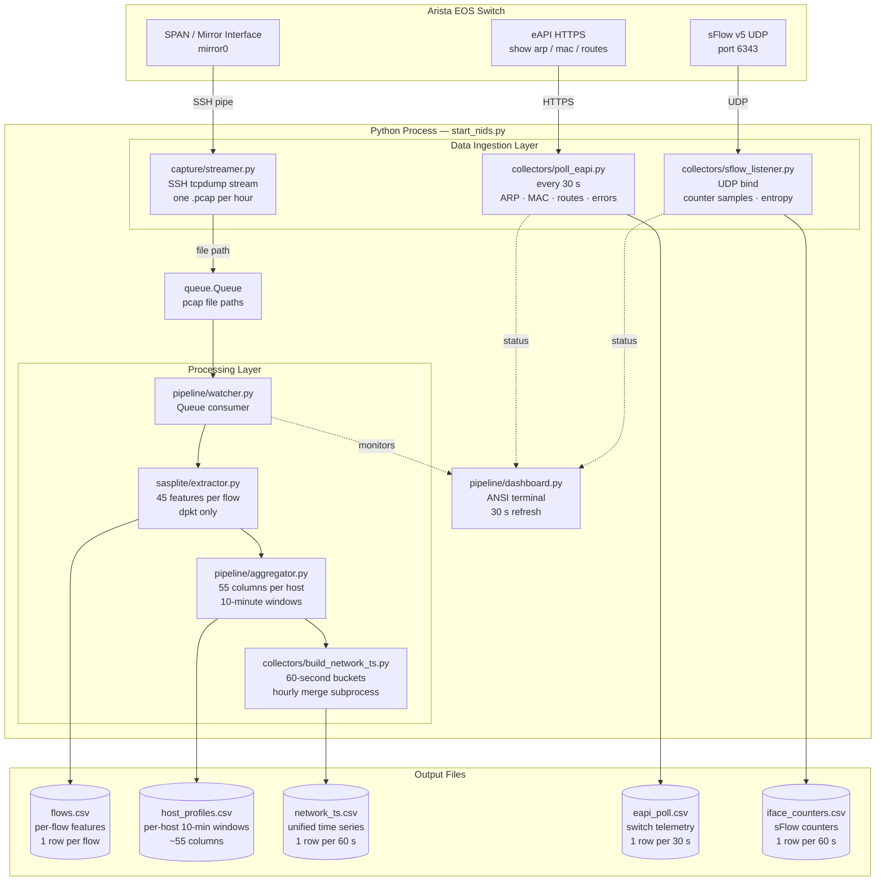
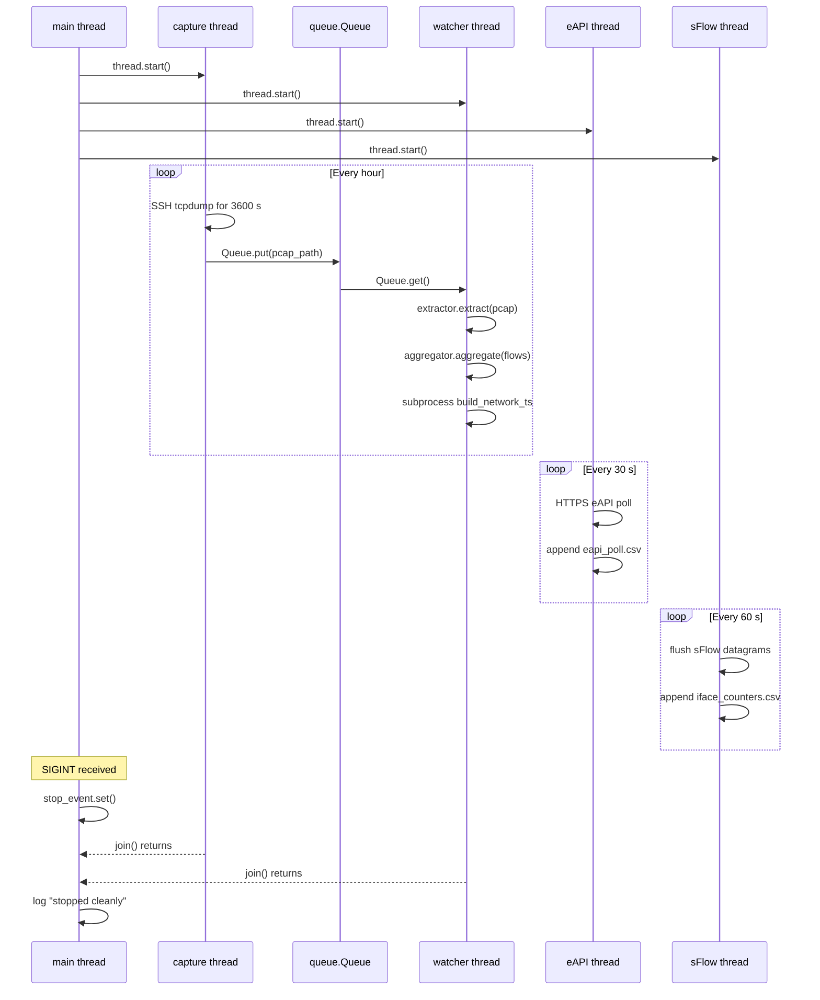
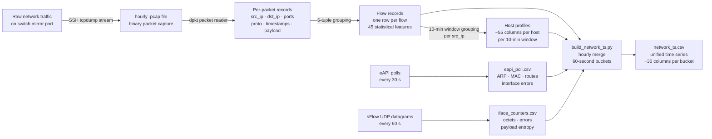

# NIDS — Network Intrusion Detection System Pipeline

An automated, multi-threaded data pipeline for continuous network traffic monitoring on Arista EOS network environments. The system streams live packet captures from a hardware switch over SSH, extracts approximately 45 per-flow statistical features using pure Python, builds per-host behavioral profiles, polls switch telemetry via eAPI, and listens for sFlow UDP datagrams — all running continuously from a single command, coordinated inside one Python process.

---

## Table of Contents

1. [What This System Does](#what-this-system-does)
2. [Design Philosophy](#design-philosophy)
3. [Key Features](#key-features)
4. [Architecture Overview](#architecture-overview)
5. [Thread Model](#thread-model)
6. [Data Flow](#data-flow)
7. [Prerequisites](#prerequisites)
8. [Installation](#installation)
9. [Configuration](#configuration)
10. [Switch Setup (Arista EOS)](#switch-setup-arista-eos)
11. [Running the Pipeline](#running-the-pipeline)
12. [Command-Line Options](#command-line-options)
13. [Output Files](#output-files)
14. [Feature Reference](#feature-reference)
15. [Module Reference](#module-reference)
16. [Logs](#logs)
17. [Retention and Cleanup](#retention-and-cleanup)
18. [Troubleshooting](#troubleshooting)
19. [Extending the Pipeline](#extending-the-pipeline)

---

## What This System Does

The NIDS pipeline solves a specific and often underserved problem in applied network security: extracting clean, structured, statistically rich feature data from a live production network without disrupting operations and without installing heavyweight software on either the switch or the monitoring host.

At a high level, the system performs four things simultaneously and continuously.

### 1. Live Packet Capture

The capture thread (`capture/streamer.py`) opens an SSH connection to an Arista EOS switch using paramiko and executes `tcpdump` on the configured mirror (SPAN) interface. The raw binary output of tcpdump is piped directly over the SSH channel to the monitoring host, where it is written to a `.pcap` file. No staging occurs on the switch. No storage is consumed on switch hardware. The SSH stream is torn down and re-established cleanly at the hour boundary, producing one `.pcap` file per hour.

When a pcap file is complete, the capture thread places the file path onto a shared `queue.Queue`. This decouples data collection from data processing — the watcher can process a backlog of files independently of the capture thread's state.

### 2. Flow Feature Extraction

The watcher thread (`pipeline/watcher.py`) blocks on the pcap queue and, upon receiving a new file path, invokes the flow extractor (`sasplite/extractor.py`). The extractor reads every packet in the pcap file using dpkt and groups them into network flows. A flow is defined as the set of all packets sharing the same 5-tuple: `(src_ip, src_port, dst_ip, dst_port, protocol)`. Direction is established by whichever endpoint sent the first packet — that endpoint is always treated as the "forward" direction; the other as "backward."

For each flow the extractor computes 45 statistical features, including inter-arrival time statistics, payload size distributions, TCP flag ratios, TTL variance, burst (subflow) detection, and TCP handshake window sizes. The result is written as a per-hour CSV with one row per flow. For a busy network this can contain millions of rows per hour.

### 3. Host Behavioral Profiling

Immediately after flow extraction, the aggregator (`pipeline/aggregator.py`) reads the per-flow CSV and collapses rows into per-host behavioral profiles over configurable time windows (default 10 minutes). For each `(host IP, 10-minute window)` pair it produces approximately 55 columns. These include aggregated flow statistics, directionality ratios (how much a host sends versus receives), the breadth of destinations contacted, the distribution of protocols used, and relative share metrics that compare each host's behavior against total network activity during the same window. These per-host profiles are the primary intended input for anomaly detection and machine learning models.

### 4. Switch Telemetry Collection

Two parallel threads independently collect data directly from the switch hardware rather than from packet captures, providing network-layer context that packet analysis alone cannot supply.

The **eAPI poller** (`collectors/poll_eapi.py`) sends HTTPS requests to the Arista switch's management API every 30 seconds, retrieving the ARP table, MAC address table, routing table size, and interface error and discard counters. ARP table churn between polls reveals potential ARP spoofing or man-in-the-middle activity. MAC table changes can expose rogue device introduction. Route table deltas may indicate route injection. Interface error spikes correlate with port scan activity or link-layer attacks.

The **sFlow listener** (`collectors/sflow_listener.py`) binds to a UDP port and parses sFlow v5 datagrams transmitted by the switch. These datagrams carry per-interface traffic counter samples (in/out octets, errors, discards) and, depending on switch configuration, sampled packet payloads. From the payloads the listener computes Shannon entropy to quantify payload randomness, which is useful for detecting encrypted tunneling and encrypted command-and-control traffic.

At the end of each hour, a batch subprocess (`collectors/build_network_ts.py`) merges all four data streams — flow CSVs, host profiles, eAPI polls, and sFlow counter samples — into a single unified time series CSV (`network_ts.csv`) with one row per 60-second bucket. A live ANSI terminal dashboard (`pipeline/dashboard.py`) refreshes every 30 seconds to show thread health, queue depth, and recent hourly summaries.

---

## Design Philosophy

**No binary dependencies.** The entire pipeline runs on Python 3.9 or later with exactly eight pip packages. There is no requirement to install Zeek, Wireshark, tshark, NFStream, sflowtool, nfdump, or any system-level package. Deployment on any Linux, macOS, or WSL environment requires only a `pip install -r requirements.txt`.

**Single entry point.** `start_nids.py` is the only entry point. There is no process manager, no Celery worker, no Redis queue, and no message broker. All coordination happens through one Python `queue.Queue` for pcap handoff and one `threading.Event` for shutdown signaling.

**Nothing hardcoded.** Every path, polling interval, threshold, and credential lives in `config.yaml`. The pipeline will refuse to start if the three required fields (`switch.host`, `switch.user`, `switch.pass`) are missing. The config file auto-discovers itself from three standard locations so the pipeline can be launched from any working directory.

**Graceful degradation.** Each data source — capture, eAPI, sFlow — is independently toggleable via both CLI flags and config file flags. If the switch is unreachable, replay mode is available: drop pcap files directly into the watcher queue. If eAPI is unconfigured, the pipeline still produces flows and profiles. No component failure cascades to other threads.

**Designed for ML pipelines.** All output is written as flat CSV files with stable, documented column schemas. This is intentional. The files can be consumed directly by pandas, scikit-learn, PyTorch, or any tabular data framework. The 45 flow features are selected to closely match the feature sets used in the NSL-KDD and CICIDS-2017/2018 benchmark datasets, making it straightforward to train models against established baselines and then evaluate them against live pipeline output.

---

## Key Features

- Live packet capture streamed directly from Arista EOS via SSH — no files staged on switch hardware
- Pure Python pcap parsing with dpkt — no tshark, Zeek, NFStream, or any system binary
- 45 per-flow statistical features covering inter-arrival times, payload size distributions, TCP flag ratios, burst behavior, TTL variance, and TCP handshake characteristics
- Per-host behavioral profiling in 10-minute windows producing approximately 55 columns per host per window
- Independent Arista eAPI poller for ARP, MAC, route, and interface telemetry every 30 seconds
- Pure Python sFlow v5 UDP parser with per-interface counter tracking and payload entropy computation
- Hourly time series merge combining all four data sources into a unified rolling CSV
- Live ANSI terminal dashboard with 30-second refresh
- Automatic file retention and cleanup configurable per data type
- Single-command startup with per-daemon enable/disable controls
- Graceful SIGINT and SIGTERM shutdown — waits for the current operation to finish
- Replay mode for processing existing pcap files without live capture
- Systemd service support for unattended production operation

---

## Architecture Overview

```
Arista EOS Switch
      │
      ├─── SSH (paramiko) ──────────────────────► capture/streamer.py
      │         tcpdump -i mirror0 -w -               │ one .pcap/hour
      │                                               │
      ├─── HTTPS eAPI (requests) ──────────────► collectors/poll_eapi.py
      │         show arp / mac / routes / ifaces       │ every 30 s
      │                                               │
      └─── sFlow v5 UDP (socket) ──────────────► collectors/sflow_listener.py
                port 6343                             │ every 60 s
                                                      │
                                    ┌─────────────────┘
                                    │
                            pipeline/watcher.py
                            (consumes pcap queue)
                                    │
                     ┌──────────────┼──────────────┐
                     │              │              │
             sasplite/          pipeline/    collectors/
             extractor.py    aggregator.py  build_network_ts.py
             (45 features)   (55 cols/host)  (30 cols/60 s)
                     │              │              │
                     ▼              ▼              ▼
               flows.csv   host_profiles.csv  network_ts.csv

                         pipeline/dashboard.py
                         (live terminal view, 30 s refresh)
```

All components run as threads inside one Python process. `start_nids.py` is the single entry point.

### Mermaid Architecture Diagram



---

## Thread Model

The pipeline runs all components inside one Python process as threads. Understanding the thread model is important for deployment decisions and for diagnosing unexpected behavior.

```
                    ┌──────────────────────────────────┐
                    │         start_nids.py            │
                    │         (main thread)            │
                    │   registers SIGINT / SIGTERM     │
                    │   calls stop_event.set()         │
                    └──────────────┬───────────────────┘
                                   │ spawns all threads
          ┌────────────┬───────────┼─────────────┬──────────────┐
          ▼            ▼           ▼             ▼              ▼
     capture        watcher      eapi          sflow        dashboard
     thread         thread       thread        thread        thread
  (non-daemon)   (non-daemon)  (daemon)      (daemon)      (daemon)
       │               ▲
       │  Queue.put()  │  Queue.get()
       └───────────────┘

                    watcher spawns per-hour
                    ┌──────────────────────┐
                    │ build_network_ts.py  │
                    │ (subprocess, not     │
                    │  a thread)           │
                    └──────────────────────┘
```

**Non-daemon threads (capture, watcher):** The main thread blocks on `.join()` for these two threads. The process will not exit until both have finished their current operation. This ensures that an in-progress pcap is always completed and the final hour is always processed before shutdown.

**Daemon threads (eAPI, sFlow, dashboard):** These terminate automatically when the main process exits. They do not hold the process open. If the main process is killed hard (SIGKILL), no data from these threads is lost because their output is written to disk at each poll interval anyway.

**Shutdown sequencing:** When SIGINT or SIGTERM arrives, the signal handler calls `stop_event.set()`. Each thread checks `stop_event.is_set()` at its natural loop boundary — after each hourly capture cycle, after each poll, after each queue operation. Threads finish their current unit of work, then exit cleanly.

**The pcap queue** is the only inter-thread communication channel for primary data. The capture thread puts a completed file path on the queue; the watcher thread blocks on `Queue.get()`. This decoupling means the watcher processes a backlog of files independently of whether the capture thread is active, which is the foundation of replay mode.



---

## Data Flow

This section traces a single unit of work — one hour of network traffic — through every stage of the pipeline to show how data is transformed at each step.



**Stage 1 — Raw capture to pcap:** The SSH channel carries the stdout of `tcpdump -i mirror0 -w -` in binary pcap format. The capture thread writes this stream to a timestamped `.pcap` file on the monitoring host. At the hour boundary the connection is closed cleanly, the file is finalized, and a new capture begins.

**Stage 2 — Pcap to flows:** The flow extractor reads the pcap using dpkt's `pcap.Reader`. For each Ethernet frame it decodes the IP header and the TCP, UDP, or ICMP payload. Packets are accumulated in an in-memory dictionary keyed by 5-tuple. After all packets are processed, each entry in the dictionary is converted to a row of 45 features by calling `_aggregate_flow()`. The resulting pandas DataFrame is written to a timestamped `flows.csv`.

**Stage 3 — Flows to host profiles:** The aggregator reads the flows CSV and groups rows by `(src_ip, time_window)` using pandas `groupby`. Within each group it computes summary statistics, directionality ratios, unique destination counts, global share metrics comparing the host against total network activity, and protocol distribution fractions. The result is appended to a `host_profiles.csv`.

**Stage 4 — Parallel telemetry:** While capture and processing happen on the pcap path, the eAPI thread independently polls the switch HTTPS API on its own 30-second cycle and appends rows to `eapi_poll.csv`. The sFlow thread parses incoming UDP datagrams and appends interface counter rows to `iface_counters.csv` every 60 seconds.

**Stage 5 — Unified time series:** After each hour's pcap is fully processed, `build_network_ts.py` runs as a subprocess. It reads the flows CSV for that hour, the eAPI CSV, and the sFlow CSV. It creates a time spine of 60-second buckets covering the hour, then joins the three data sources onto the spine using nearest-timestamp matching. The result is 60 new rows appended to `network_ts.csv`, each representing one minute of network activity from the perspective of all four data streams simultaneously.

---

## Prerequisites

| Requirement | Version | Notes |
|---|---|---|
| Python | 3.9+ | Standard library only for core parsing |
| pip packages | see below | No system binaries needed |
| Arista EOS switch | any modern | eAPI must be enabled; mirror/SPAN interface required |

**Zero system binary dependencies.** No `apt install` required beyond Python. No Zeek, tshark, NFStream, sflowtool, or nfdump.

---

## Installation

```
# 1. Clone or copy the nids/ directory to your machine
cd nids

# 2. (Recommended) create a virtual environment
python3 -m venv .venv
source .venv/bin/activate          # Linux/macOS/WSL
# or on Windows:
# .venv\Scripts\activate

# 3. Install all dependencies
pip install -r requirements.txt
```

### requirements.txt contents

```
dpkt>=1.9.8          # pcap parsing — the ONLY packet library used
paramiko>=3.4.0      # SSH to Arista switch for tcpdump stream
requests>=2.31.0     # eAPI HTTPS polling
PyYAML>=6.0.1        # config.yaml parsing
pandas>=2.1.0        # DataFrames for features and aggregation
numpy>=1.26.0        # vectorised feature computation
scipy>=1.11.0        # entropy calculation in network_ts
psutil>=5.9.0        # process/resource monitoring
```

**Why these specific packages?**

- `dpkt` is the only packet-parsing library. It is a thin, pure Python wrapper around libpcap's file format with no native code beyond what Python itself includes. It was chosen over scapy (too heavyweight, requires root for raw sockets), PyShark (tshark dependency), and NFStream (compiled C extensions) to keep the dependency tree minimal and the install unconditional.
- `paramiko` provides the SSH transport used to pipe tcpdump output from the switch. It handles key exchange, encryption, and channel multiplexing without requiring OpenSSH client binaries.
- `requests` handles eAPI HTTPS calls. Arista's eAPI is a simple JSON-over-HTTPS interface; a dedicated library (pyeapi) was deliberately avoided to reduce dependencies.
- `scipy` is used only for `scipy.stats.entropy` in the network_ts builder to compute Shannon entropy of destination port distributions — a feature useful for detecting scanning behavior and data exfiltration.

---

## Configuration

All settings live in `config.yaml`. **Nothing is hardcoded.**

```
cp config.yaml config.yaml.bak   # keep a backup
nano config.yaml                  # or your preferred editor
```

### Minimum required fields

```
switch:
  host: "192.168.1.1"    # management IP of your Arista switch
  user: "admin"          # eAPI + SSH username
  pass: "your_password"  # password (plain text; restrict file permissions)
```

The pipeline refuses to start if any of these three are empty.

### Full config reference

```yaml
# ── Switch ─────────────────────────────────────────────────────────
switch:
  host: ""               # Arista switch management IP
  user: ""               # eAPI + SSH username
  pass: ""               # password
  interface: "mirror0"   # SPAN/mirror interface name (tcpdump runs here)
  ssh_port: 22           # SSH port (default 22)
  verify_ssl: false      # EOS uses self-signed certs — keep false

# ── Capture ────────────────────────────────────────────────────────
capture:
  duration_sec: 3600     # seconds per pcap file (3600 = 1 hour)
  retry_wait_sec: 15     # wait before retrying a failed capture
  base_dir: ""           # where to save pcap files
                         # Windows example: C:\Users\You\Desktop\captures
                         # Linux/WSL example: /data/pcaps
                         # Windows paths are auto-converted to WSL /mnt/c/...

# ── Feature extraction ─────────────────────────────────────────────
sasplite:
  subflow_gap_s: 1.0     # inter-packet silence > this value ends an active burst

# ── Aggregation ────────────────────────────────────────────────────
aggregation:
  host_profile_window_min: 10   # group flows into N-minute windows per host
  business_hours_start: 8       # used for future anomaly context (hour 0-23)
  business_hours_end: 20

# ── eAPI polling ───────────────────────────────────────────────────
eapi:
  poll_interval_s: 30    # how often to poll the switch (seconds)
  timeout_s: 5           # HTTP request timeout

# ── sFlow listener ─────────────────────────────────────────────────
sflow:
  listen_port: 6343      # UDP port to bind (standard sFlow port)
  parse_interval_s: 60   # how often to flush received datagrams to CSV

# ── Output paths ───────────────────────────────────────────────────
paths:
  output_base:  "/data/nids/output"           # root for all per-hour dirs
  flows_dir:    "/data/nids/output/flows"     # per-hour flows CSVs
  profiles_dir: "/data/nids/output/host_profiles"
  network_ts:   "/data/nids/output/network_ts.csv"   # rolling append
  eapi_out:     "/data/nids/collectors/eapi_poll.csv"
  sflow_out:    "/data/nids/collectors/iface_counters.csv"
  logs:         "/var/log/nids"

# ── Retention ──────────────────────────────────────────────────────
retention:
  keep_pcaps_days: 7     # delete pcap files older than N days
  keep_csvs_days:  30    # delete CSV files older than N days

# ── Process control ────────────────────────────────────────────────
daemons:
  capture: true    # set false to disable SSH capture (replay mode)
  eapi:    true    # set false to disable eAPI polling
  sflow:   true    # set false to disable sFlow listener

# ── Timeouts ───────────────────────────────────────────────────────
timeouts:
  extractor_s:  3600   # max seconds for feature extraction per pcap
  aggregator_s: 300    # max seconds for host profile aggregation
  build_ts_s:   300    # max seconds for network_ts build subprocess
```

### Config auto-discovery

The pipeline searches for `config.yaml` in this order when `--config` is not specified:

```
1. ./config.yaml             (current working directory)
2. ../config.yaml            (parent directory)
3. /etc/nids/config.yaml     (system-wide install)
```

### Securing the config

The password for the switch is stored in plaintext in `config.yaml`. Restrict file permissions immediately after editing:

```
chmod 600 config.yaml   # restrict read access to owner only
```

For production deployments, consider populating `switch.pass` from an environment variable or secrets manager rather than writing it to disk. The config loader can be extended to read `os.environ.get("NIDS_SWITCH_PASS")` as a fallback.

---

## Switch Setup (Arista EOS)

### 1. Enable eAPI

```
management api http-commands
   protocol https
   no shutdown
```

Verify:

```
show management api http-commands
```

### 2. Create a SPAN/mirror session

```
monitor session 1 source interface Ethernet1 - Ethernet48
monitor session 1 destination interface mirror0
```

Replace `Ethernet1 - Ethernet48` with the interfaces you want to mirror. `mirror0` must match `config.yaml → switch.interface`.

What the SPAN session does: It copies every frame arriving on or departing from the source interfaces and delivers a duplicate to `mirror0`. The NIDS monitoring host, running tcpdump on `mirror0` via SSH, therefore sees every packet crossing those interfaces without any inline interception. The original traffic is never touched.

### 3. Create a dedicated user (recommended)

```
username nids privilege 15 secret <password>
```

Privilege 15 is required for both SSH (to run tcpdump on the mirror interface) and eAPI (to run `show` commands). For tighter security, a custom role can be created that permits only the specific `show` commands the poller uses.

### 4. Enable sFlow (optional)

```
sflow sample 1024
sflow polling-interval 30
sflow destination <your_machine_ip> 6343
sflow source-interface Management0
sflow run
```

Replace `<your_machine_ip>` with the IP of the machine running NIDS, and `6343` with `config.yaml → sflow.listen_port`.

The `sample 1024` setting means one in every 1024 packets is sampled for payload inspection. This is a reasonable default that provides good statistical coverage without generating excessive UDP traffic. The `polling-interval 30` causes interface counter exports every 30 seconds regardless of sampling.

---

## Running the Pipeline

### Basic start

```
python3 start_nids.py
```

The pipeline starts all daemons and shows a live dashboard in the terminal. Press **Ctrl+C** to stop cleanly (finishes the current operation first).

### Validate config without connecting

```
python3 start_nids.py --dry-run
```

Output example:

```
DRY RUN — would start:
  Capture:  SSH to 192.168.1.1:22  iface=mirror0
  eAPI:     polling 192.168.1.1 every 30s
  sFlow:    listening UDP port 6343
  Watcher:  processing pcaps → /data/nids/output
```

### Selective daemon control

```
# Only run eAPI polling and sFlow (no SSH capture)
python3 start_nids.py --no-capture

# Run capture + watcher only (no switch telemetry)
python3 start_nids.py --no-eapi --no-sflow

# Process existing pcap files without live capture
# (drop pcap paths into the queue manually via the watcher)
python3 start_nids.py --no-capture --no-eapi --no-sflow
```

You can also permanently disable any daemon in `config.yaml`:

```yaml
daemons:
  capture: false   # never SSH to the switch
  eapi:    true
  sflow:   false
```

### Use an alternate config file

```
python3 start_nids.py --config /path/to/other_config.yaml
```

### Run in background (Linux/WSL)

```
nohup python3 start_nids.py > /var/log/nids/stdout.log 2>&1 &
echo $! > /var/run/nids.pid
```

Stop it:

```
kill $(cat /var/run/nids.pid)
```

### Run as a systemd service

```ini
# /etc/systemd/system/nids.service
[Unit]
Description=NIDS Data Pipeline
After=network.target

[Service]
Type=simple
User=nids
WorkingDirectory=/opt/nids
ExecStart=/opt/nids/.venv/bin/python3 start_nids.py --config /etc/nids/config.yaml
Restart=on-failure
RestartSec=30

[Install]
WantedBy=multi-user.target
```

```
sudo systemctl daemon-reload
sudo systemctl enable nids
sudo systemctl start nids
sudo journalctl -u nids -f
```

With systemd, the dashboard's ANSI output should be redirected rather than printed to the journal. Redirect stdout in the service file with `StandardOutput=append:/var/log/nids/stdout.log` if needed.

---

## Command-Line Options

| Flag | Default | Description |
|---|---|---|
| `--config PATH` | auto-discover | Path to `config.yaml` |
| `--no-capture` | off | Disable SSH tcpdump capture thread |
| `--no-eapi` | off | Disable eAPI polling thread |
| `--no-sflow` | off | Disable sFlow UDP listener thread |
| `--dry-run` | off | Print what would start, then exit cleanly |

Config auto-discovery order: `./config.yaml` → `../config.yaml` → `/etc/nids/config.yaml`

---

## Output Files

All output paths are configurable in `config.yaml → paths`.

### flows.csv (per-flow features)

Written per hour to `flows_dir/YYYYMMDD_HHMM_flows.csv`. One row per TCP/UDP/ICMP flow. Millions of rows for busy networks.

| Column | Type | Description |
|---|---|---|
| `src_ip` | str | Source IP address |
| `dst_ip` | str | Destination IP address |
| `src_port` | int | Source port (0 for ICMP) |
| `dst_port` | int | Destination port (0 for ICMP) |
| `proto` | int | IP protocol number (6=TCP, 17=UDP, 1=ICMP) |
| `ts_start` | float | Unix timestamp of first packet |
| `ts_end` | float | Unix timestamp of last packet |
| `flow_duration` | float | Duration in seconds |
| `flow_iat_mean` | float | Mean inter-arrival time across all packets |
| `flow_iat_std` | float | Std dev of inter-arrival times |
| `flow_iat_max` | float | Max inter-arrival time |
| `fwd_iat_mean` | float | Mean IAT for forward direction packets |
| `fwd_iat_std` | float | Std dev of forward IATs |
| `fwd_iat_max` | float | Max forward IAT |
| `bwd_iat_mean` | float | Mean IAT for backward direction packets |
| `bwd_iat_std` | float | Std dev of backward IATs |
| `bwd_iat_max` | float | Max backward IAT |
| `fwd_pkt_len_mean` | float | Mean forward payload size (bytes) |
| `fwd_pkt_len_std` | float | Std dev of forward payload sizes |
| `fwd_pkt_len_max` | float | Max forward payload size |
| `bwd_pkt_len_mean` | float | Mean backward payload size |
| `bwd_pkt_len_std` | float | Std dev of backward payload sizes |
| `bwd_pkt_len_max` | float | Max backward payload size |
| `pkt_len_variance` | float | Variance of all payload sizes in flow |
| `init_win_bytes_fwd` | int | TCP window size in first SYN (forward) |
| `init_win_bytes_bwd` | int | TCP window size in first SYN-ACK (backward) |
| `min_seg_size_forward` | int | Minimum non-zero forward payload size |
| `active_time_mean` | float | Mean duration of active packet bursts |
| `idle_time_mean` | float | Mean duration of idle gaps between bursts |
| `syn_flag_ratio` | float | Fraction of packets with SYN flag set |
| `ack_flag_ratio` | float | Fraction of packets with ACK flag set |
| `fin_flag_ratio` | float | Fraction of packets with FIN flag set |
| `rst_flag_ratio` | float | Fraction of packets with RST flag set |
| `psh_flag_ratio` | float | Fraction of packets with PSH flag set |
| `urg_flag_ratio` | float | Fraction of packets with URG flag set |
| `ip_ttl_mean` | float | Mean TTL across all packets |
| `ip_ttl_std` | float | Std dev of TTL values |
| `ip_proto` | int | IP protocol (same as `proto`, for grouping) |
| `n_fwd_pkts` | int | Count of forward packets |
| `n_bwd_pkts` | int | Count of backward packets |
| `n_fwd_bytes` | int | Total forward payload bytes |
| `n_bwd_bytes` | int | Total backward payload bytes |

### host_profiles.csv (per-host behavioral profiles)

Written per hour to `output_base/YYYYMMDD_HHMM/host_profiles.csv`. One row per `(src_ip, 10-minute window)`. Approximately 55 columns.

Key columns beyond the flow features:

| Column | Description |
|---|---|
| `window_start` | Start of the 10-minute window (datetime) |
| `src_ip` | Host IP address |
| `n_flows` | Number of flows in this window |
| `dir_ratio_bytes` | Bytes sent / bytes received (upload/download ratio) |
| `unique_dest_ip_count` | Number of distinct destination IPs contacted |
| `unique_dest_port_count` | Number of distinct destination ports used |
| `global_flow_share` | This host's flows as fraction of all network flows |
| `global_byte_share` | This host's bytes as fraction of all network bytes |
| `global_port_share` | This host's unique ports as fraction of network-wide unique ports |
| `tcp_ratio` | Fraction of flows using TCP |
| `udp_ratio` | Fraction of flows using UDP |
| `icmp_ratio` | Fraction of flows using ICMP |

The global share metrics (`global_flow_share`, `global_byte_share`, `global_port_share`) are particularly useful for anomaly detection. A host that suddenly represents an unusually high share of total network flows while maintaining a very high count of unique destination ports is a strong indicator of port scanning activity, regardless of the absolute volume of traffic.

### network_ts.csv (network-wide time series)

Rolling append at `paths.network_ts`. One row per 60-second bucket, 60 rows added per hour. Merges flows, eAPI, and sFlow data.

| Column | Source | Description |
|---|---|---|
| `timestamp` | derived | 60-second bucket start time |
| `flows_per_sec` | flows | Flow count / 60 |
| `bytes_per_sec` | flows | Total bytes / 60 |
| `tcp_ratio` | flows | Fraction of TCP flows in bucket |
| `udp_ratio` | flows | Fraction of UDP flows in bucket |
| `icmp_ratio` | flows | Fraction of ICMP flows in bucket |
| `active_src_ips` | flows | Unique source IPs in bucket |
| `active_dst_ips` | flows | Unique destination IPs in bucket |
| `dst_port_entropy` | flows | Shannon entropy of destination port distribution |
| `byte_asymmetry` | flows | `(fwd_bytes - bwd_bytes) / total_bytes` |
| `avg_flow_duration_s` | flows | Mean flow duration |
| `syn_no_ack_rate` | flows | Flows with high SYN + low ACK ratio per second |
| `avg_iat_std` | flows | Mean of per-flow IAT standard deviations |
| `high_rst_rate` | flows | Flows with RST ratio > 0.5 per second |
| `arp_changed_count_net` | eAPI | ARP entries that changed MAC in this bucket |
| `mac_new_count_net` | eAPI | New MACs appearing in MAC table |
| `route_delta_max` | eAPI | Max change in route table size |
| `total_iface_errors` | eAPI | Total interface errors from switch |
| `total_iface_discards` | eAPI | Total interface discards from switch |
| `iface_down_count` | eAPI | Number of interfaces in non-connected state |
| `total_in_bytes_net` | sFlow | Sum of in-octets deltas across all interfaces |
| `total_out_bytes_net` | sFlow | Sum of out-octets deltas |
| `total_iface_errors_net` | sFlow | Sum of in+out errors from sFlow counters |
| `payload_entropy_mean` | sFlow | Mean Shannon entropy of sampled packet payloads |

### eapi_poll.csv

Written to `paths.eapi_out` every 30 seconds. One row per poll.

| Column | Description |
|---|---|
| `timestamp` | Poll time (UTC ISO 8601) |
| `switch_ip` | Switch management IP |
| `arp_table_size` | Total ARP table entries |
| `arp_changed_count` | Entries whose MAC changed since last poll |
| `arp_new_count` | New IPs appearing in ARP table |
| `mac_table_size` | Total MAC table unicast entries |
| `mac_new_count` | New MACs since last poll |
| `mac_lost_count` | MACs that disappeared since last poll |
| `route_count` | Total routes in default VRF |
| `route_delta` | Change in route count since last poll |
| `total_iface_errors` | Total interface input errors (delta) |
| `total_iface_discards` | Total interface discards |
| `iface_down_count` | Interfaces not in "connected" state |

### iface_counters.csv

Written to `paths.sflow_out` every 60 seconds by the sFlow listener.

| Column | Description |
|---|---|
| `timestamp` | Flush time (UTC ISO 8601) |
| `agent_ip` | IP of the sFlow agent (switch) |
| `if_index` | Interface index (SNMP ifIndex) |
| `in_octets` | Cumulative inbound octets |
| `out_octets` | Cumulative outbound octets |
| `in_discards` | Inbound discards |
| `out_discards` | Outbound discards |
| `in_errors` | Inbound errors |
| `out_errors` | Outbound errors |
| `in_octets_delta` | Inbound octets since last flush |
| `out_octets_delta` | Outbound octets since last flush |

---

## Feature Reference

### How flows are identified

A flow is a 5-tuple: `(src_ip, src_port, dst_ip, dst_port, proto)`. Direction is assigned by whichever endpoint sent the first packet — that endpoint is always "forward" (fwd), the other is "backward" (bwd). All packets in a pcap file with the same 5-tuple (or its reverse) belong to the same flow record.

ICMP flows use a port of 0 since ICMP has no port numbers. This means all ICMP between a given source and destination IP is grouped into one flow per pcap file, which is intentional — ICMP ping floods and ICMP tunnels manifest as single high-volume flows rather than many small ones.

### Active/idle burst detection

The `subflow_gap_s` setting (default 1.0 second) controls burst boundaries. Consecutive packets separated by less than `subflow_gap_s` are in the same active burst. A gap larger than `subflow_gap_s` ends the burst and starts an idle period.

- `active_time_mean` — mean duration of active bursts across the flow
- `idle_time_mean` — mean duration of idle gaps across the flow

This feature pair is significant for distinguishing interactive sessions (many short bursts with long idle gaps) from bulk transfers (one sustained active period) from automated reconnaissance (extremely short bursts with extremely short idle gaps).

### TCP handshake features

- `init_win_bytes_fwd` — window size advertised in the first SYN packet
- `init_win_bytes_bwd` — window size advertised in the first SYN-ACK packet

These are 0 for UDP and ICMP flows.

TCP window size fingerprinting is valuable for detecting OS spoofing and for identifying scanning tools that use non-standard TCP stacks. Nmap, for instance, uses known window sizes depending on scan type that differ from those used by standard operating system network stacks.

### TCP flag ratios and what they reveal

The six TCP flag ratio columns (`syn_flag_ratio`, `ack_flag_ratio`, `fin_flag_ratio`, `rst_flag_ratio`, `psh_flag_ratio`, `urg_flag_ratio`) express the fraction of packets in the flow that carry each flag.

High `syn_flag_ratio` with near-zero `ack_flag_ratio` and zero `fin_flag_ratio` is the hallmark of a SYN flood or SYN scan — many connection attempts with no completions. High `rst_flag_ratio` suggests the destination is actively rejecting connections or a scanning tool is sending RST to close half-open connections quickly. Elevated `urg_flag_ratio` is unusual in benign traffic and often indicates evasion attempts or protocol fuzzing.

### Why Shannon entropy matters in network_ts

`dst_port_entropy` in network_ts measures the Shannon entropy of the distribution of destination ports across all flows in a 60-second bucket. In normal traffic, most flows go to a small number of well-known ports (80, 443, 53, 22), producing a low entropy value. A port scan spreads connections across a very large number of ports uniformly, producing high entropy. `payload_entropy_mean` from sFlow samples serves an analogous function for payload content: benign plaintext traffic (HTTP, SMTP) has low entropy; encrypted tunnels and steganographic channels have entropy near the maximum of 8 bits per byte.

---

## Module Reference

```
nids/
├── start_nids.py               Entry point — starts all threads
│
├── config.yaml                 All settings (never hardcoded elsewhere)
├── requirements.txt            pip dependencies
│
├── capture/
│   └── streamer.py             SSH to switch → tcpdump stdout → local .pcap
│                               Functions: capture_one(), run()
│                               Helpers:   windows_to_wsl(), make_save_path()
│
├── sasplite/
│   └── extractor.py            dpkt pcap reader → flows DataFrame (45 cols)
│                               Classes: FlowExtractor, FlowState
│                               Functions: _process_packet(), _aggregate_flow()
│
├── pipeline/
│   ├── watcher.py              Queue consumer: pcap → extract → aggregate → ts
│   │                           Function: run()
│   ├── aggregator.py           Flows → per-host 10-min profiles (55 cols)
│   │                           Class: HostProfileAggregator
│   └── dashboard.py            ANSI terminal live status (30 s refresh)
│                               Function: run()
│
├── collectors/
│   ├── poll_eapi.py            Arista eAPI HTTPS poller (every 30 s)
│   │                           Function: run()
│   ├── sflow_listener.py       Pure Python sFlow v5 UDP parser + CSV writer
│   │                           Function: run()
│   └── build_network_ts.py     Hourly batch: merge 4 sources → network_ts.csv
│                               Can also be run standalone (see below)
│
└── utils/
    ├── config_loader.py        YAML → SimpleNamespace, validates required fields
    │                           Functions: load_config(), get()
    ├── logger.py               Rotating file + stdout logging
    │                           Function: get_logger()
    └── csv_writer.py           Thread-safe atomic CSV append
                                Functions: append_rows(), read_csv(), tail_rows()
```

### Module descriptions

**`capture/streamer.py`** manages the lifecycle of a single SSH connection to the switch. The `capture_one()` function opens the SSH channel, spawns the tcpdump command on the remote side, reads the stdout pipe in chunks, and writes them to a local file. `make_save_path()` generates timestamped file paths under `capture.base_dir`. `windows_to_wsl()` converts Windows-style paths (`C:\Users\...`) to WSL mount paths (`/mnt/c/Users/...`) automatically, so the same config works on both Windows-WSL and native Linux.

**`sasplite/extractor.py`** is the core of the pipeline. `FlowState` is a dataclass that accumulates packet-level observations for one flow (timestamp lists, payload size lists, flag observations, TTL values). `_process_packet()` is called once per packet from the pcap reader: it decodes the Ethernet frame, identifies the IP and transport headers, determines flow direction by comparing the packet's 5-tuple against the canonical form, and appends to the appropriate `FlowState`. `_aggregate_flow()` is called once per flow after all packets are processed: it computes all 45 statistics from the accumulated per-packet lists and returns a dict that becomes one row of the output DataFrame.

**`pipeline/watcher.py`** is a loop around `queue.Queue.get()`. When it receives a file path it calls the extractor, then the aggregator, then spawns `build_network_ts.py` as a subprocess with a timeout. It updates `shared_status` with queue depth and operation timing, which the dashboard reads. It also runs the retention cleanup after each successful hour.

**`pipeline/aggregator.py`** reads a flows DataFrame and applies pandas `groupby` over `(src_ip, time_window)`. The `HostProfileAggregator.aggregate()` method computes the approximately 55 host profile columns and writes the result. Global share metrics are computed by first calculating totals across all hosts in the window and then dividing each host's values by those totals — a straightforward normalization step that makes profiles comparable across different times of day and different overall traffic volumes.

**`collectors/poll_eapi.py`** calls four Arista `show` commands per poll cycle: `show arp`, `show mac address-table`, `show ip route summary`, and `show interfaces`. It computes delta values (how much each quantity changed since the last poll) by comparing the current response against state stored from the previous cycle. The delta columns (`arp_changed_count`, `mac_new_count`, `route_delta`) are more useful for anomaly detection than absolute values because they capture change, not size.

**`collectors/sflow_listener.py`** implements a pure Python sFlow v5 datagram parser from scratch without any sFlow library dependency. It binds a `socket.socket(AF_INET, SOCK_DGRAM)` to the configured UDP port and runs a receive loop. Each datagram is parsed according to the sFlow v5 specification: version field, agent IP, sequence number, system uptime, and a sequence of flow samples and counter samples. Counter samples update the per-interface state dictionary; flow samples are held in memory until the flush interval, at which point payload entropy is computed and the batch is appended to the CSV.

**`utils/csv_writer.py`** provides a thread-safe `append_rows()` function that writes to CSV files atomically using a per-file threading lock. This prevents corruption from concurrent writes between the watcher and eAPI/sFlow threads, which all write to their respective output files independently.

### Running build_network_ts.py standalone

```
# Build network_ts for the previous hour (default)
python3 -m collectors.build_network_ts

# Build for a specific hour
python3 -m collectors.build_network_ts --hour 2025052609

# Use custom flows CSV and output path
python3 -m collectors.build_network_ts \
    --flows /data/nids/output/flows/20250526_0900_flows.csv \
    --output /data/nids/output/network_ts.csv

# Preview without writing
python3 -m collectors.build_network_ts --dry-run
```

---

## Logs

Log files are written to `config.yaml → paths.logs` (default `/var/log/nids`).

| File | Contains |
|---|---|
| `nids.log` | Main pipeline — startup, shutdown, summary per hour |
| Rotated as | `nids.log.1`, `nids.log.2`, … up to 5 backups, 10 MB each |

Log format:

```
2025-05-26 09:00:15  nids                 INFO      NIDS Pipeline starting — 5 threads
2025-05-26 09:00:15  nids                 INFO      Started thread: capture
2025-05-26 10:00:42  nids                 INFO      Extracted 142847 flows, 45 cols from 09_00_to_10_00.pcap
2025-05-26 10:04:38  nids                 INFO      Pipeline 20250526_0900 — OK — flows=142847 profiles=1204 (238.1s)
```

To tail logs while running:

```
tail -f /var/log/nids/nids.log
```

The logger uses Python's `logging.handlers.RotatingFileHandler` with a maximum file size of 10 MB and five backup files, giving approximately 60 MB of log retention before the oldest entries are overwritten.

---

## Retention and Cleanup

The watcher automatically deletes old files after each successful hour:

| Setting | Default | What gets deleted |
|---|---|---|
| `retention.keep_pcaps_days` | 7 | `.pcap` files older than N days |
| `retention.keep_csvs_days` | 30 | `.csv` files in output dirs older than N days |

`network_ts.csv` and `eapi_poll.csv` are excluded from cleanup (they roll up forever). Delete them manually if needed.

The cleanup runs at the end of each successful watcher cycle, after `build_network_ts.py` completes. It uses `pathlib.Path.stat().st_mtime` to determine file age. Files that are currently being written are not deleted because the deletion pass only touches files in the configured output directories, not the current-hour working file.

---

## Troubleshooting

### "Config error: switch.host must be a non-empty string"

Edit `config.yaml` and fill in the three required fields:

```yaml
switch:
  host: "192.168.1.1"
  user: "admin"
  pass: "yourpassword"
```

### SSH capture fails immediately

Check:

1. Switch IP is reachable: `ping 192.168.1.1`
2. SSH works manually: `ssh admin@192.168.1.1`
3. `mirror0` interface exists on the switch: `show interfaces mirror0`
4. The user has privilege 15 (needed to run tcpdump)
5. `capture.base_dir` in config.yaml is set and writable

### eAPI returns 401 Unauthorized

The user must have eAPI access. On EOS:

```
management api http-commands
   no shutdown
```

Also confirm `switch.user` and `switch.pass` match exactly.

### eAPI SSL error

Set `verify_ssl: false` in config.yaml (already default). EOS uses self-signed certificates.

### sFlow datagrams not received

1. Confirm the switch is sending to this machine's IP on port 6343
2. Check firewall: `sudo ufw allow 6343/udp`
3. The listener logs "sFlow listener bound to UDP port 6343" on startup — if you don't see that, check for port conflicts: `ss -ulnp | grep 6343`

### "No flows extracted from pcap"

Possible causes:

- The pcap file is empty (capture stopped early — check SSH logs)
- All traffic on `mirror0` is non-IP (VLAN tags, raw L2 frames)
- dpkt could not parse the link-layer type — check `pcap.datalink()`

### network_ts.csv is missing rows

`build_network_ts.py` runs as a subprocess after each hour. If it fails, the watcher logs `build_network_ts failed` with the last 500 chars of stderr. Run it manually to see the full error:

```
python3 -m collectors.build_network_ts --hour 2025052609 --dry-run
```

### Dashboard is garbled

The dashboard uses ANSI escape codes to overwrite its own output. It requires a terminal that supports ANSI (any modern terminal does). In non-interactive environments (cron, systemd), redirect stdout:

```
python3 start_nids.py > /var/log/nids/stdout.log 2>&1
```

### Memory usage grows over a long session

The flow extractor holds the entire pcap's worth of `FlowState` objects in memory while parsing. For very high-bandwidth environments, a single hour's pcap can contain several gigabytes of data. If memory pressure is a concern, reduce `capture.duration_sec` to 1800 (30 minutes) to produce smaller files and shorter extraction cycles.

### Windows path handling

If `capture.base_dir` is a Windows path (`C:\captures`), the path is automatically converted to its WSL equivalent (`/mnt/c/captures`) by `windows_to_wsl()` in `capture/streamer.py`. No manual adjustment is needed. Ensure the target Windows path is accessible from within WSL.

---

## Extending the Pipeline

### Add a new flow feature

1. Open `sasplite/extractor.py`
2. Compute the value in `_aggregate_flow()` using `pkts`, `fwd`, `bwd` arrays
3. Add it to the returned dict
4. Add the column name to `HostProfileAggregator.aggregate()` in `pipeline/aggregator.py` if you want it in profiles

### Add a new host profile feature

1. Open `pipeline/aggregator.py`
2. Compute it inside the `for (window, src_ip), grp in df.groupby(...)` loop
3. Add it to the `row` dict

### Add a new network_ts metric

1. Open `collectors/build_network_ts.py`
2. Add computation in Step B, C, or D
3. The time-spine join in Step E picks it up automatically

### Replay existing pcap files

```python
# Drop a path directly into the watcher queue from Python
import queue, threading
from utils.config_loader import load_config
from pipeline.watcher import run as run_watcher

cfg      = load_config()
q        = queue.Queue()
stop     = threading.Event()
status   = []

q.put("/path/to/existing.pcap")
stop_after_one = threading.Timer(5, stop.set)
stop_after_one.start()

run_watcher(q, cfg, stop, print, status)
```

Or use the standalone extractor directly:

```python
from pathlib import Path
from utils.config_loader import load_config
from sasplite.extractor import FlowExtractor
import logging

cfg     = load_config()
log     = logging.getLogger("test")
ex      = FlowExtractor(cfg, log)
df      = ex.extract(Path("capture.pcap"))
print(df.head())
```

### Connecting downstream ML models

Because all output is written as standard CSV files, no special integration is required. A typical downstream workflow looks like this:

```python
import pandas as pd
from sklearn.ensemble import IsolationForest

# Load host profiles from the last 24 hours
profiles = pd.read_csv("/data/nids/output/host_profiles/20250526_0900_profiles.csv")

# Drop non-numeric columns
X = profiles.drop(columns=["src_ip", "window_start"])

# Fit anomaly detector
clf = IsolationForest(contamination=0.01, random_state=42)
clf.fit(X)

# Score each host-window record
profiles["anomaly_score"] = clf.decision_function(X)
profiles["is_anomaly"] = clf.predict(X) == -1

# Print flagged hosts
print(profiles[profiles["is_anomaly"]][["src_ip", "window_start", "anomaly_score"]])
```

The `network_ts.csv` file can similarly be fed to a time series anomaly detection model (LSTM autoencoder, Prophet, or a sliding window z-score detector) to flag unusual network-wide behavior at the 60-second granularity.

---

## License

This project is released for research and educational purposes. Review your organization's policy before deploying packet capture infrastructure on any network.
